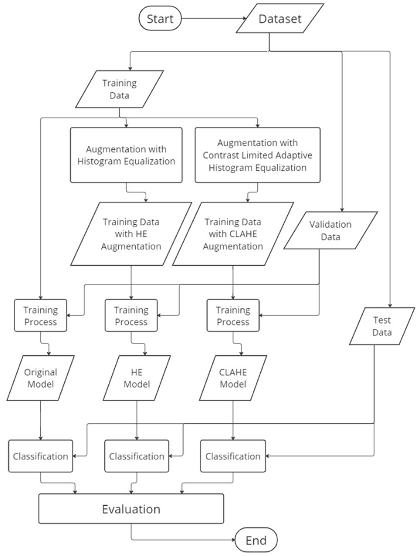
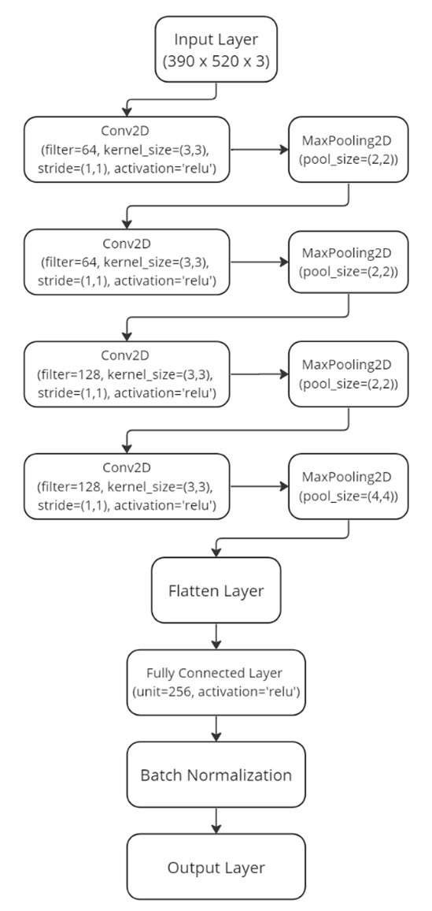

# Analysis of Effect of Image Augmentation with Image Enhancement on Fish Image Classification Using Convolutional Neural Network

URL Paper : [Analysis of Effect of Image Augmentation with Image Enhancement on Fish Image Classification Using Convolutional Neural Network](https://ieeexplore.ieee.org/document/10330888)

Published By: [ICTS 2023](https://ieeexplore.ieee.org/xpl/conhome/10330802/proceeding?isnumber=10330826)

## Dataset 

Fish-gres Dataset : https://data.mendeley.com/datasets/76cr3wfhff/1

## Augmentation with Image Enhancement

1. Histogram Equalization
2. Contrast Limited Adaptive Histogram Equalization

## Training Data

1. Original Training Data : 2270 Images
2. HE Augmentation Training Data : 4540 Images
3. CLAHE Augmentation Training Data : 4540 Images

## Model

List Model that used on this paper:
1. ResNet50 Pre-Trained Model
2. Xception Pre-Trained Model
3. VGG16 Pre-Trained Model
4. Without Pre-Trained Model

CNN Without Pre-Trained Model Architecture

For Pre-Trained model architecture, just change the convolutional layer with pre-trained model architecture and the rest is the same.

## Training Process

Every Architecture Model trained by 3 Training Data without other augmentations.